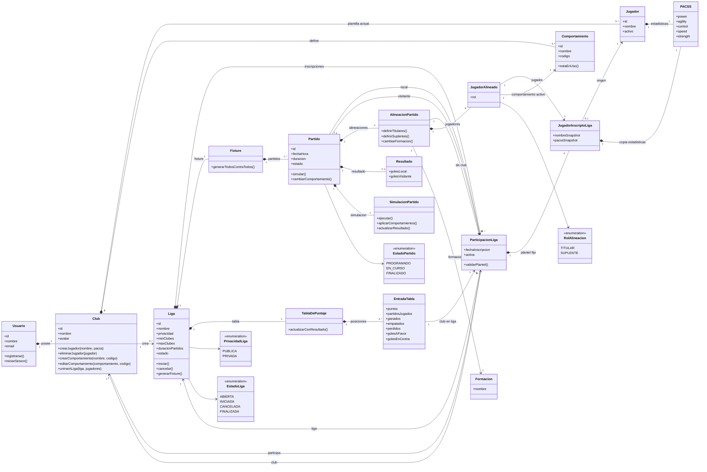

# Diagrama de clases v0.1 - FutBot

Version conceptual inicial del modelo de dominio. El objetivo es representar las
entidades principales y reglas de negocio conocidas, sin cerrar detalles de
implementacion.

## Reglas de negocio representadas

- Cada usuario posee un unico club.
- El avatar pertenece al club.
- Un club puede tener jugadores ilimitados.
- Los jugadores se crean con nombre y estadisticas PACSS. Luego no se editan.
- PACSS esta compuesto por power, agility, control, speed y strength.
- Los comportamientos pertenecen al club y tienen nombre y codigo.
- Un club puede crear comportamientos repetidos si quiere.
- Durante un partido se pueden cambiar comportamientos activos, pero no crear ni
  editar comportamientos.
- Como un club puede jugar partidos simultaneamente, el comportamiento activo se
  modela dentro de `JugadorAlineado`, es decir, en el contexto de un partido.
- Un club puede participar en varias ligas.
- Una liga es todos contra todos.
- Una liga tiene minimo 3 clubes. El maximo lo define el club creador.
- Para unirse a una liga, el club debe seleccionar exactamente 6 jugadores.
- Esos 6 jugadores quedan guardados en la participacion de esa liga hasta que la
  liga termine.
- Si un jugador se elimina del club durante la liga, sigue existiendo como
  `JugadorInscriptoLiga` dentro de esa liga.
- Antes de cada partido se define una alineacion con 3 titulares, 3 suplentes y
  una formacion.
- Los titulares, suplentes y la formacion pueden cambiar antes de cada partido,
  pero siempre usando los 6 jugadores inscriptos en la liga.
- El partido puede simularse sin que el usuario intervenga, ya que los
  comportamientos actuan automaticamente.

## Decisiones abiertas para proximas versiones

- Detallar la clase `Formacion` con posiciones concretas.
- Definir si habra eventos de partido, por ejemplo goles, pases, choques,
  cambios de comportamiento o sustituciones.
- Definir como se valida que un comportamiento esta en uso.
- Definir reglas exactas de puntaje de la tabla.
- Definir si los partidos tienen fecha programada fija o se ejecutan apenas
  ambos clubes tienen alineacion.
